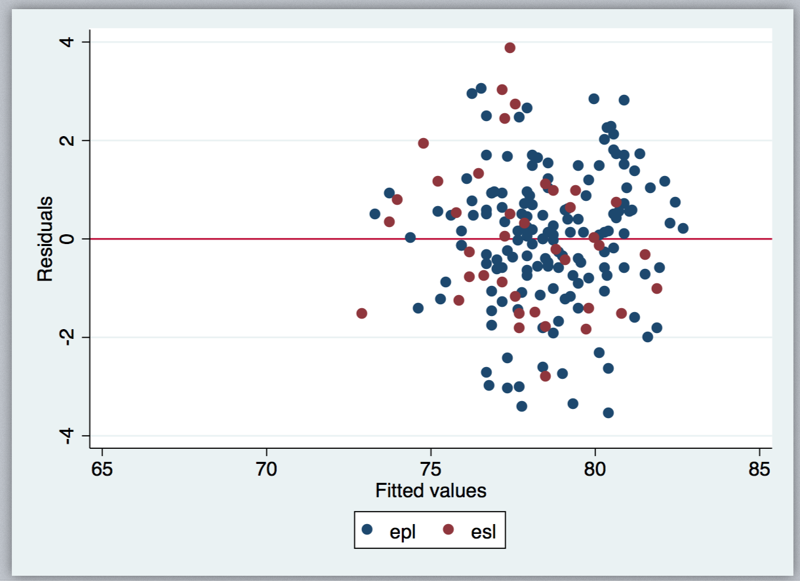

## Comparing speaker points for EPL vs ESL speakers at WUDC 2017 vs Oxford and Cambridge IVs 2016

*Jessica Yung, 5 January 2017. Idea and previous tests run by Lucia Arce and Jure Hederih.*


### 1. Summary
For each speaker in our dataset, we regressed their WUDC 2017 average speaker score on (1) the average of their non-zero average speaker score(s) at the Oxford and Cambridge IVs 2016 and (2) whether or not they had ESL status. There were 193 speakers in our dataset, 62 of whom had ESL status.

We found that the coefficient on `is_esl` was -0.696 and was non-zero at the 99% confidence level (t-stat of -2.77). Thus, **there is sufficient evidence at the 1% significance level to reject the claim that there is no bias towards ESL speakers that existed at WUDC 2017 compared to the Oxford and Cambridge IVs 2016**.


### 2. Data preprocessing:
1. Download (copy) speaker tabs from WUDC2017, Oxford IV 2016 and Cambridge IV 2016. [Tabbie.org](https://www.tabbie.org/)

2. Remove speakers who have not completed all five rounds or are swing speakers from the tab.
    * If speakers have not completed all five rounds, they may have been ill and so other confounding factors likely affected their performance.
    * Swing speakers may not be  taking the tournament seriously. Their on-tab names may also be wrong.
    * The average speaks also tend to be wrong in that they are an average across rounds-including-those-where-said-speaker-got-zero-speaks.

3. Generate dummy variable `is_esl` for each speaker. A speaker is considered to have ESL status if they have had ESL status at any one of the three tournaments.
4. Record only the average speaker score at each tournament for each speaker.
    * Variables for each speaker: `wudc2017_avg`, `oxiv2016_avg`, `camiv2016_avg`.
5. Generate value for variable `mean_ox_cam_ivs_2016` for each speaker which takes the mean of their average speaker scores at the Oxbridge and Cambridge IVs 2016. 
    * If a speaker only went to one of these tournaments, their mean is their average speaker score at the tournament they went to. 
        * E.g. If `speaker` went to the Oxford IV and had a mean speaker score of 99 and did not go to the Cambridge IV, `mean_ox_cam_ivs_2016` for that speaker is 99.
    * If a speaker did not go to any of these tournaments, this is left blank.
6. Keep only data for speakers that have non-blank values for `mean_ox_cam_ivs_2016` and `wudc2017_avg`.
    * There are 193 speakers remaining, 62 of whom have ESL status.


### 3. Hypothesis and Regression
```
H_0: is_esl = 0
H_1: is_esl != 0 (is not equal to zero)
```

We regress `wudc2017_avg` on `is_esl` and `mean_ox_cam_ivs_2016`.


### 4. Results


We found that the coefficient on `is_esl` was -0.696 and was non-zero at the 99% confidence level (t-stat of -2.77). Thus, **there is sufficient evidence at the 1% significance level to reject the claim that there is no bias towards ESL speakers that existed at WUDC 2017 compared to the Oxford and Cambridge IVs 2016**.


### 5. Caveats and Improvements
This is a simple regression. We **have not partialled out the effects of factors** such as speaker gender, motion-weightedness combined with position or chair judge characteristics, all of which might contribute to the difference between WUDC 2017 average speaker scores and Oxbridge IV 2016 average speaker scores per speaker. (See R^2 of 0.6548 which is lower than we'd like.) We have **not tested that the data comply with Gauss-Markov assumptions either**. These are improvements we can implement.


### 6. Appendix

#### 6.1 STATA logs:

```
. import delimited avg_speaks_per_tournament_with_oxcam_mean.csv
(11 vars, 1,230 obs)

. reg wudc2017_avg mean_ox_cam_ivs_2016 

      Source |       SS           df       MS      Number of obs   =       193
-------------+----------------------------------   F(1, 191)       =    340.81
       Model |  691.763028         1  691.763028   Prob > F        =    0.0000
    Residual |  387.685389       191  2.02976643   R-squared       =    0.6408
-------------+----------------------------------   Adj R-squared   =    0.6390
       Total |  1079.44842       192  5.62212717   Root MSE        =    1.4247

--------------------------------------------------------------------------------------
        wudc2017_avg |      Coef.   Std. Err.      t    P>|t|     [95% Conf. Interval]
---------------------+----------------------------------------------------------------
mean_ox_cam_ivs_2016 |   .7793599   .0422165    18.46   0.000     .6960895    .8626304
               _cons |   17.34411   3.313113     5.23   0.000     10.80913     23.8791
--------------------------------------------------------------------------------------


. reg wudc2017_avg is_esl mean_ox_cam_ivs_2016 


      Source |       SS           df       MS      Number of obs   =       193
-------------+----------------------------------   F(2, 190)       =    180.19
       Model |  706.812099         2  353.406049   Prob > F        =    0.0000
    Residual |  372.636318       190  1.96124378   R-squared       =    0.6548
-------------+----------------------------------   Adj R-squared   =    0.6512
       Total |  1079.44842       192  5.62212717   Root MSE        =    1.4004

--------------------------------------------------------------------------------------
        wudc2017_avg |      Coef.   Std. Err.      t    P>|t|     [95% Conf. Interval]
---------------------+----------------------------------------------------------------
              is_esl |  -.6958016   .2511865    -2.77   0.006    -1.191274   -.2003291
mean_ox_cam_ivs_2016 |   .7755008   .0415212    18.68   0.000     .6935991    .8574025
               _cons |   17.78743   3.260639     5.46   0.000     11.35573    24.21913
--------------------------------------------------------------------------------------


. predict yhat
(option xb assumed; fitted values)
(844 missing values generated)

. predict residuals, res
(1,037 missing values generated)


. twoway (scatter residuals mean_ox_cam_ivs_2016 if is_esl==0) (scatter residuals mean_ox_cam_ivs_2016 if is_esl==1), yline(0) legend(labe
> l(1 epl) label(2 esl))

. twoway (scatter residuals yhat if is_esl==0) (scatter residuals yhat if is_esl==1), yline(0) legend(label(1 epl) label(2 esl))

. 
```

#### 6.2 Plots of residuals 

Residuals are the difference between the predicted `wudc_2017avg` values and the true `wudc_2017avg` values.



